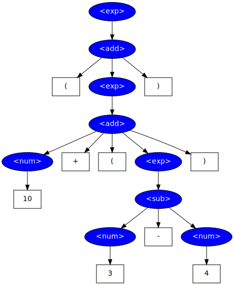

FlyParse: an on-the-fly parser
==============================

FlyParse is a parser for LL(k) languages that operates through recursive descent
with backtracking.

[Parser generators](http://en.wikipedia.org/wiki/Parser_generator) such as
ANTLR, Yacc or Bison take a grammar as input and produce code for a parser
specific to that grammar, which must then be compiled to be used. On the
contrary, FlyParse reads the definition of the grammar (expressed in
[Backus-Naur Form](http://en.wikipedia.org/wiki/Backus-Naur_form) (BNF)) at
runtime and can readily parse strings on the spot.

An example
----------

Consider for example the following simple grammar, taken from the file
`Examples/Simple-Math.bnf` in the FlyParse archive:

    <exp> := <add> |  | <mul> | 
 | - <exp> | <num>;
    <add> := <num> + <num> | ( <exp> + <exp> );
     := <num> - <num> | ( <exp> - <exp> );
    <mul> := <num> × <num> | ( <exp> × <exp> );
    
 := <num> ÷ <num> | ( <exp> ÷ <exp> );
    <num> := ^[0-9]+$;

Here is a simple Java program that reads characters strings and tries to parse
them against this grammar (a complete working program can be found in the file
`SimpleExample.java`:
    
    try
    {
      BnfParser parser = new BnfParser("Examples/Simple-Math.bnf");
      ParseNode node1 = parser.parse("3+4");
      ParseNode node2 = parser.parse("(10 + (3 - 4))");
    }
    catch (IOException | InvalidGrammarExpression | ParseException)
    {
      System.err.println("Some error occurred");
    }

The first instruction loads the grammar definition and instantiates an object
`parser` for that grammar. Calls to method `parse()` give this parser a
character string, and return an object of class `ParseNode` which points to the
head of the corresponding parse tree (or null if the input string does not
follow the grammar). These instructions are enclosed in a try/catch block to
catch potential exceptions thrown during this process. The whole process is done
dynamically at runtime, without requiring any compiling.

Here is the parse tree returned for the second expression in the previous
example:

The grammar must be [LL(k)](http://en.wikipedia.org/wiki/LL_parser). Roughly,
this means that it must not contain a production rules of the form
<S> := <S> something. Trying to parse such a rule by recursive descent causes
an infinite recursion (which will throw a ParseException when the maximum
recursion depth is reached).
